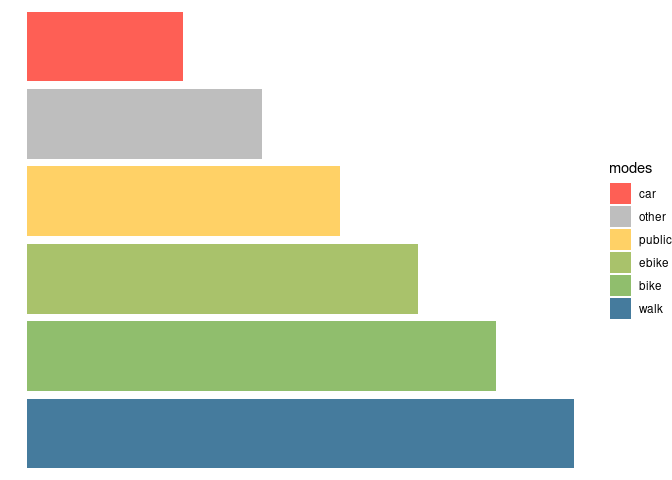
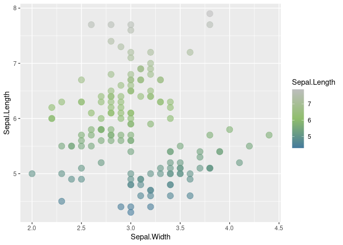
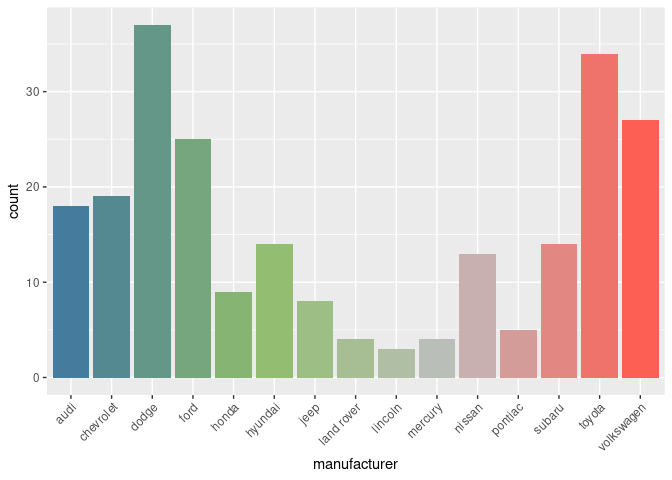
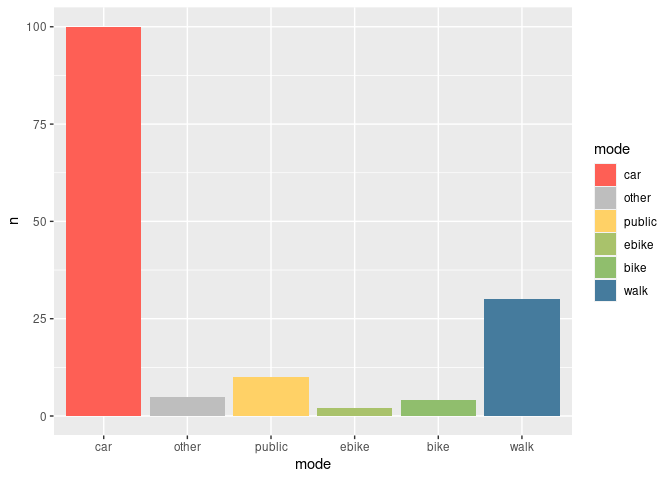

    {
      "full": {
        "car": ["#fe5f55"],
        "other": ["#BEBEBE"],
        "public": ["#ffd166"],
        "ebike": ["#A9C26B"],
        "bike": ["#90be6d"],
        "walk": ["#457b9d"]
      },
      "main": {
        "walk": ["#457b9d"],
        "bike": ["#90be6d"],
        "other": ["#BEBEBE"],
        "car": ["#fe5f55"]
      },
      "no_transit": {
        "walk": ["#457b9d"],
        "bike": ["#90be6d"],
        "other": ["#BEBEBE"]
      },
      "no_other": {
        "walk": ["#457b9d"],
        "bike": ["#90be6d"],
        "public": ["#ffd166"]
      }
    } 

Using linear interpolation the palette can be expanded to cover many
modes. Following the example from Simon, we can create plot of car
manufacturers with colors adjusting between the main colours as follows.

Although the figure is not supposed to be realistic (are Volkswagens
really closer to walking than Audis?!) it highlights an important point:
mode of transport can be seen as a continuous variable from high
speed/weight/power to active modes such as walking. An electric cargo
bike is somewhere between a ‘normal’ bike and public/private transport
options. Thus we can expand the palette:

The above shows the importance of selecting good colours for modes.
